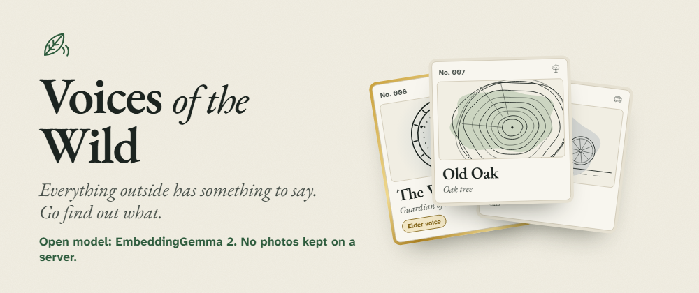
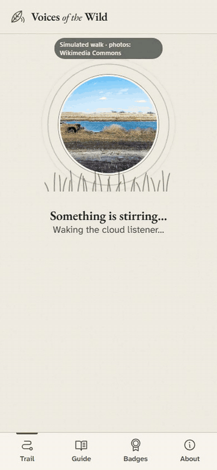
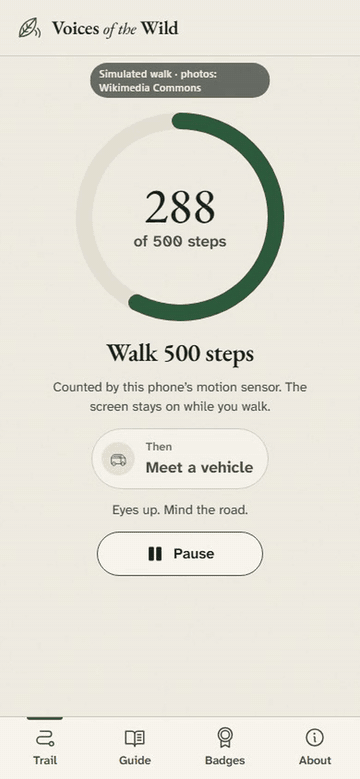
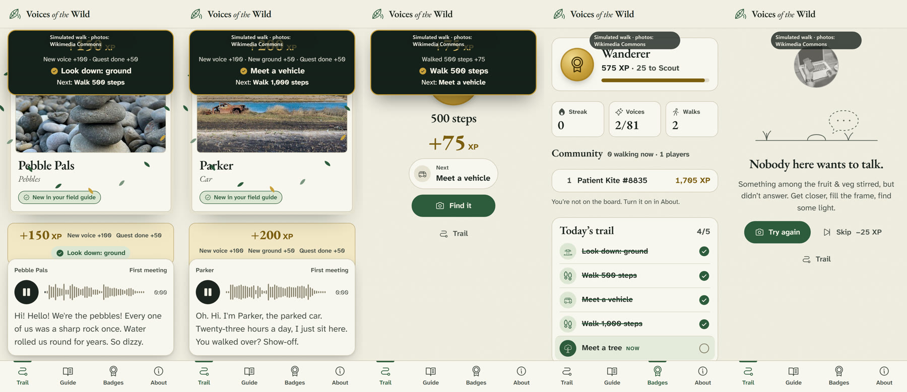
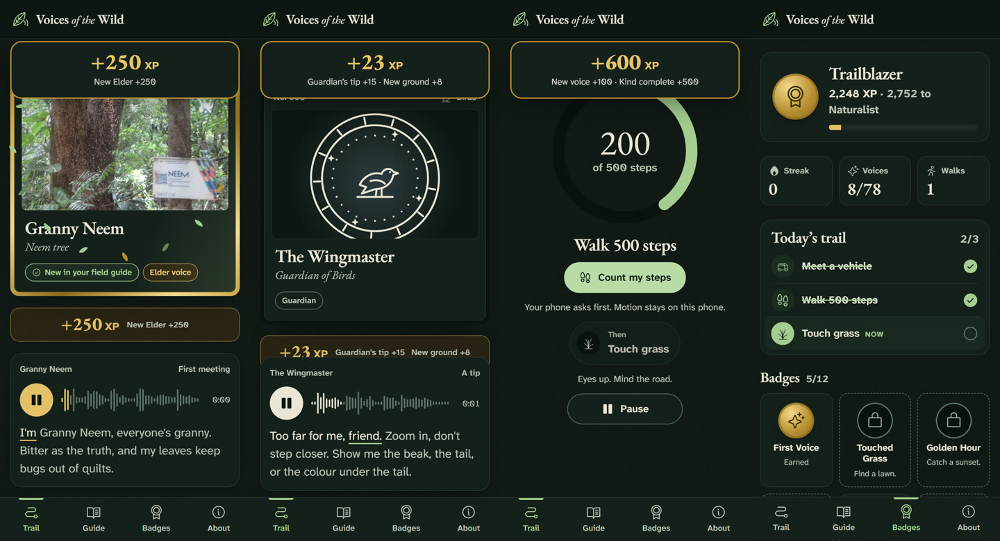

<p align="center">
  
</p>

<h1 align="center">Voices of the Wild</h1>

<p align="center">
  <b>Point your phone at something outside. It works out what it is, on the phone, and that thing talks back.</b><br/>
  A tree, a crow, a bus, a puddle, the moon: 78 characters and 13 guardians, 286 captioned voice lines.<br/>
  After one setup on wifi the app makes <b>zero network requests</b>, and your photos never leave the phone.
</p>

<p align="center">
  <a href="https://voices-of-the-wild.netlify.app"><b>▶ Try it live: voices-of-the-wild.netlify.app</b></a><br/>
  <sub>Best on an Android phone in Chrome. First visit downloads the field kit (~320 MB, once, on wifi); after that it works in airplane mode.</sub>
</p>

<p align="center">
  
  
  
  
  
</p>

<p align="center">
  
  &nbsp;&nbsp;
  
</p>

<p align="center"><sub>Entry for the DEV Hacktoberfest Open-Source AI Challenge, Week 1: <b>Touch Grass</b>. Full showcase video: <a href="docs/showcase-9x16.mp4">docs/showcase-9x16.mp4</a></sub></p>

---

## The idea

Most apps want your eyes on the screen. This one wants the screen off. You only take the phone out for the photo; the rest of the time it is a voice in your ear and a reason to walk down a different street.

1. **Snap** something outdoors.
2. **Match.** EmbeddingGemma 2 runs in the browser and compares the photo with 400 character descriptions.
3. **Listen.** If it is sure, that character speaks, with live captions. If it isn't, it doesn't guess: a **guardian** asks for a closer look.
4. **Walk.** The next quest is a walk. The phone counts your steps, then unlocks the next thing to find.

<p align="center">
  
</p>

## The game: a quest chain that makes you move

Every day has a **trail of 3 to 5 quests**, the same for everyone, unlocked one at a time:

> *Meet a vehicle* → **Walk 500 steps** → *Touch grass* → **Walk 1,000 steps** → *Meet a flower*

- **Steps, not minutes.** The accelerometer feeds a small step detector in the browser ([`game/steps.ts`](app/src/game/steps.ts)): a gravity baseline, smoothed peaks with hysteresis, and at least 270 ms between steps, so shaking the phone can't go faster than a running pace. A wake lock keeps the screen on during a walk, because browsers pause motion events when it turns off. A laptop has no sensor, so there the app says it is estimating from time.
- **Every XP gain pops up** above the voice line: *+300 XP · Quest done · Next: Walk 500 steps*.
- **XP:** new voice 100, new Elder 250, finished quest 50, a walk 75 per 500 steps. A different kind from your last find adds +50%. Repeat snaps within 60 s earn nothing.
- **Streaks** with one grace day a week, **12 badges**, **5 ranks**, and 26 rare gold **Elders**.
- Characters never tell you to touch wildlife, pick things, climb, eat what you find, or step into traffic. Risky things warn you in character.

<p align="center">
  
</p>

## How it works

```
photo ─► downscale in the browser ─► EmbeddingGemma 2 (q4, WebGPU → wasm) ─► 768-d vector
                                                                                 │
           400 descriptions, embedded at build time with the same model ◄────────┘ cosine
                                                                                 │
        category threshold ─► species threshold + margin ─► character │ guardian │ nobody
                                                                                 │
                         pre-recorded voice line + captions ◄────────────────────┘
```

| | |
|---|---|
| **Matching** | [`onnx-community/embeddinggemma-2-ONNX`](https://huggingface.co/onnx-community/embeddinggemma-2-ONNX) at `q4` with [Transformers.js](https://github.com/huggingface/transformers.js). Score per character is the max over its descriptions; hierarchical (category, then species); a guardian answers when the margin is thin. |
| **Voices** | **ElevenLabs Eleven v4** performs the 26 Elders (78 lines). **Kokoro-82M**, open source, voices the other 208 lines. Both run at build time only; the app never calls either. |
| **Offline** | The model, vectors, voices, fonts and icons are cached by a service worker. After setup, `allowRemoteModels = false`. The acceptance test goes to airplane mode, reloads and collects a character: **0 network attempts**. |
| **Privacy** | No backend, no account, no analytics, no third-party scripts. Photos are embedded on the phone; an optional small copy of your latest photo per character stays in IndexedDB for the card. |
| **Accessibility** | WCAG 2.2 AA target: captions for every line, full keyboard and screen-reader support, `prefers-reduced-motion`, 44 px touch targets, one-handed on a phone. |

### Calibration

On **232 real Wikimedia photos**, cross-validated: the right character is named **78.9%** of the time, a guardian asks for a closer look **14.7%**, a wrong name **5.6%**. Whenever it names someone, it is right **93.4%** of the time. Full report: [pipeline/calibration/REPORT.md](pipeline/calibration/REPORT.md) · photo credits: [ATTRIBUTION.md](pipeline/calibration/ATTRIBUTION.md).

## Run it

```bash
cd app
npm install
npm test          # 63 unit tests: matching, quest chain, step detector, streaks, badges, captions
npm run dev       # http://localhost:5173  (add ?mock to script outcomes, ?debug for match scores)
npm run build     # typecheck + production PWA in dist/
```

| Folder | What |
|---|---|
| [`app/`](app/README.md) | The PWA: Vite, TypeScript, lit-html, Workbox. Tests and end-to-end tools in `app/tools/`. |
| [`pipeline/`](pipeline/README.md) | Build-time scripts: description embeddings, calibration, voice generation (idempotent, `--dry-run`). |
| [`data/`](data/CONTRACT.md) | The character roster, the writing spec and the data contract. |
| [`showcase/`](showcase/README.md) | The showcase video, built with Remotion from the real app screens and voice files. |
| [`demo/`](demo/README.md), [`pitch/`](pitch/) | Screen-recording pipeline and the pitch deck. |

Regenerating Elder voices needs an ElevenLabs key in `week-1/.env` as `elevenlabs-api-key` (gitignored). Nothing else needs a key.

## Credits

Voices by **ElevenLabs** (Eleven v4). **Kokoro-82M** (Apache 2.0). **EmbeddingGemma 2** by Google DeepMind (Apache 2.0). **Transformers.js** (Apache 2.0) and **ONNX Runtime Web** (MIT). Icons by **Phosphor** (MIT). Fonts: **EB Garamond** and **Atkinson Hyperlegible Next** (SIL OFL). Calibration and sample photos from Wikimedia Commons, credited in [ATTRIBUTION.md](pipeline/calibration/ATTRIBUTION.md).

Code licensed [MIT](LICENSE).

## Commit timeline

Built 5 to 12 Oct 2026 for the DEV Hacktoberfest Week 1 challenge. Any commit after Mon 12 Oct 06:59 UTC is listed below.

### Post-deadline changes

None.
